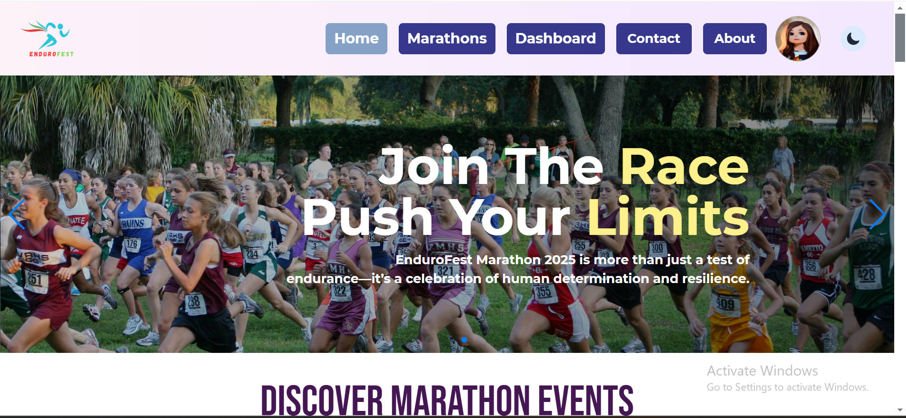

# Project Name: EnduroFest

# Project Overview

EnduroFest is a marathon management system website built by react which enables organizers to create marathon events and manage events. Participants can view detailed information of specific marathon and also apply and update their application.

# Technologies: 
* React
* Tailwind CSS
* MongoDB
* Firebase

# Key Features

* Organizers can add new marathon events, view own created marathon, can update info and remove event.

* Participants can apply in marathon events, view their own applied marathon, can update info and remove application.

* User can log in and register through email and password and with google also

* Application Registration button will activate according to event registration time.

* Additional Features: data loading spinner, 404/ not found page, dynamic title for pages etc.

# Used Packages
* react
* react-router
* sweetalert
* swiperjs
* firebase
* react-icon

# Dependencies

* firebase: ^11.0.2
* localforage: ^1.10.0
* match-sorter: ^8.0.0
* react: ^18.3.1
* react-dom: ^18.3.1
* react-icons: ^5.3.0
* react-router-dom: ^7.0.1
* sort-by: ^1.2.0
* sweetalert2: ^11.14.5

# Dev Dependencies

* @eslint/js: ^9.15.0
* @types/react: ^18.3.12
* @types/react-dom: ^18.3.1
* @vitejs/plugin-react: ^4.3.4
* autoprefixer: ^10.4.20
* daisyui: ^4.12.14
* eslint: ^9.15.0
* eslint-plugin-react: ^7.37.2
* eslint-plugin-react-hooks: ^5.0.0
* eslint-plugin-react-refresh: ^0.4.14
* globals: ^15.12.0
* postcss: ^8.4.49
* tailwindcss: ^3.4.15
* vite: ^6.0.1

# Guideline to Run Project in Local Machine:

## Installation

Run npm install to install project dependencies.

## Environment setup
Create a .env file and put your environment variable there. Save the following variable:
VITE_apiKey,
VITE_authDomain,
VITE_projectId,
VITE_storageBucket,
VITE_messagingSenderId,
VITE_appId

## Usage
Run `npm run dev` to run the project locally.

# Links: 

* Api Link : https://endurofest-server-zeta.vercel.app/
* Live Link: https://endurofest-1f5d3.web.app/
